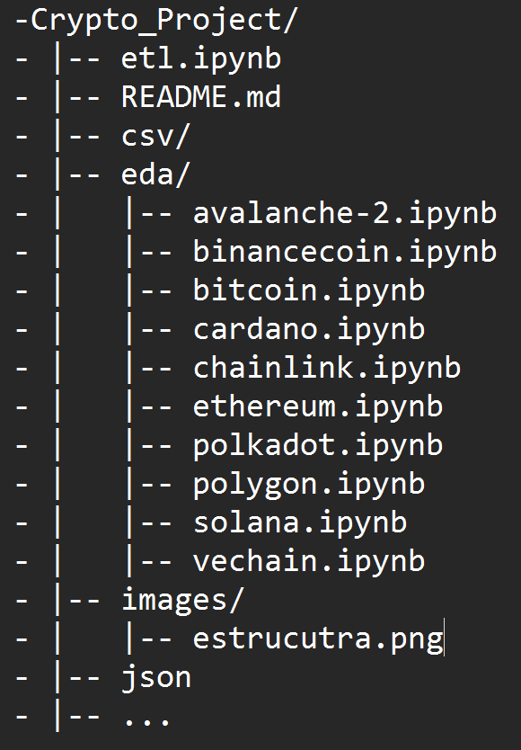

# PROYECTO INDIVIDUAL Nº2
## Cryptocurrency Market Data Analytics

### Descripción del problema:
Se puede leer el contexto y rol a desarrollar en https://github.com/soyHenry/PI_DA

### Requerimientos:
- Realizar ETL y EDA usando como fuente de datos obligatoria API CoinGecko
- Dashboard para utilizar en demo de presentacion del informe 
- Análisis con datos-dashboard y también los análisis y conclusiones que se puedan extraer.
- KPIs sugerir 3 KPIs adecuadamente representados de forma visual en el dashboard.
- Repositorio de GitHub debe contener un Readme y un reporte de análisis

### Resolución:
- Desarrollo en Python.
- Fuente de datos: API CoinGecko, API Binance
- Fuentes alternativas: CoinMarketCap, CoinGecko, TradingView Binance, Binance, Coinbase, Bard, ChatGPT.
- Librerias: datetime, time, requests, json, csv, os, pandas,numpy, matplotlib, seaborn, statistics.
- Power BI

### Estructura

- `Crypto_Project/`: directorio raíz del repositorio de GitHub, contiene todos los archivos y carpetas relacionados con el proyecto.
- `informe.pdf`: archivo que contiene reporte de análisis, 
- `etl.ipynb`: notebook que contiene código utilizado para realizar la extracción, transformación y carga de datos (Extract, Transform-ETL).
- `README.md`: notebook que contiene código utilizado para realizar la extracción, transformación y carga de datos (Extract, Transform-ETL).
- `csv/`: directorio que contiene los archivos obtenidos de laa Api CionGecko por cada criptomoneda elegida para el proyecto.
- `eda/`: directorio que contiene un notebook por cada criptomoneda elegida con el análisis exploratorio de los datos (Exploratory Data Analysis-EDA).

### Escala
En función de consignas y requerimientos se obtuvo la fecha mas antigua de registro de datos en la Api. para cada criptomoneda, a partir de ahi datasets individuales.
Los mismos pueden tener una cantidad de datos insuficientes para conclusiones definitivas pero se entiende aadecuado a los fines pedaagogicos de este trabajo. 

### Autor
Javier de la Fuente  dlfavier@gmail.com
